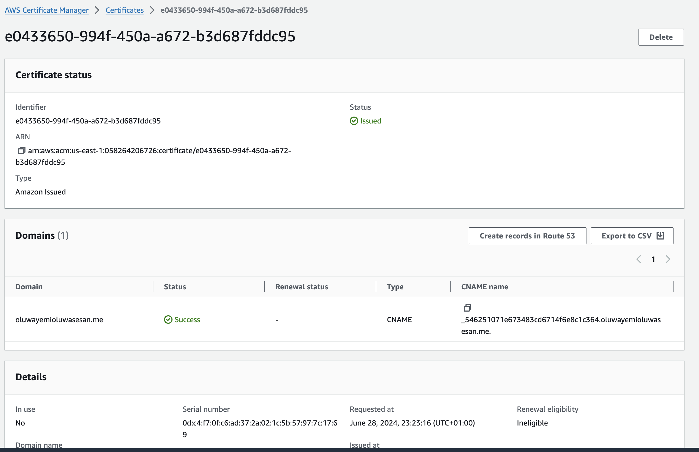

# Deploying a Static Website on AWS using Terraform

The goal of this project is to deploy a static website using AWS S3, CloudFront, and Route 53 managed with Terraform.

# Documentation

1. Ensured I have a wokring domain name with namecheap
    

2. The first thing i did was creat my S3 bucket; I ensure it uploaded my website content in the root
   

3a. The next thing I did was to creat my cloudfront   
    

3b. I also created my origin access control so i can add it to my s3-bucket policy and Attach the policy to my s3 when creating my cloud front
   

4. I also Went to check my AWS console to check if cloud front can serve my page since i blocked public access on my s3-bucket, and it worked
   

5. I Created my route53 hosted zone with my domain name
   

6. requested for the certificate and it was issued 
   

   time did not permit to finish bbut this is how far i could go... Thanks Boss for this opportunity to practicalize what u have been teaching us